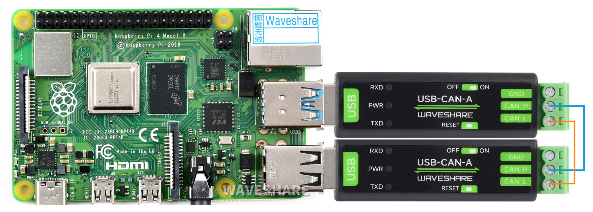

# aa55cand

A small daemon that bridges the Waveshare **USB-CAN-A** adapter to a Linux
SocketCAN interface.



*(Photo: [Waveshare Wiki](https://www.waveshare.com/wiki/USB-CAN-A))*

## What this is

USB-CAN-A is a ~$10 USB-to-CAN adapter: a CH340 USB-serial chip talks plain
UART to an STM32 microcontroller, which drives the actual CAN transceiver.
There is no native USB CAN device here — to Linux it just shows up as
`/dev/ttyUSB0`, and the STM32's firmware speaks its own binary framing over
that serial link (header `0xAA 0x55`, fixed 20-byte frames, checksum). See
[`PROTOCOL.md`](PROTOCOL.md) for the full frame layout, transcribed from the
[official Waveshare protocol page](https://www.waveshare.com/wiki/Secondary_Development_Serial_Conversion_Definition_of_CAN_Protocol).

That protocol has no Linux kernel support and isn't SLCAN — there's no
existing tool that turns this adapter into a normal `can0` you can point
`candump`/`cansend`/python-can at. `aa55cand` does exactly that: one side is
a `PF_CAN` raw socket bound to a real SocketCAN interface, the other is the
adapter's native binary protocol. It sends the adapter's configuration frame
(bus speed, mode) on startup and translates `struct can_frame` to/from the
20-byte wire format in both directions, including 29-bit extended IDs.

## What this is not

- Not `gs_usb`/candleLight — that needs the CAN chip to speak native USB
  directly. Here the CH340 is the actual USB device; the STM32 behind it is
  invisible to the host beyond whatever bytes it puts on the UART. No
  firmware change on any USB-CAN-A can make it a native USB CAN device.
- Not CAN FD, and not the Waveshare **USB-CAN-B** (a different, native-USB
  product with its own unrelated protocol).
- Not a kernel driver — there's no dedicated in-kernel driver for this
  adapter family, so a userspace bridge is the only option (the same
  approach every other USB-CAN-A project takes; see Credits).
- Not what `python-can`'s `seeedstudio` interface gives you either. That
  backend talks the same shared protocol family (its config command matches
  [`PROTOCOL.md`](PROTOCOL.md) byte-for-byte, just using the variable-length
  data-frame mode instead of the fixed 20-byte one), but it's a Python-only
  `Bus` object — `candump`/`cansend`/wireshark still can't touch it. Only a
  real SocketCAN netdevice, which is what `aa55cand` provides, does that.

## Usage

```
make
sudo ip link add dev vcan0 type vcan   # or any other CAN netdevice
sudo ip link set up vcan0
./aa55cand /dev/ttyUSB0 vcan0 0x05     # 0x05 = 250 kbit/s, see -h for the table
```

Then use `candump`/`cansend`/etc. on `vcan0` as normal.

See [`systemd/`](systemd/) for running this automatically when the adapter
is plugged in.

## Credits

- [Waveshare's protocol page](https://www.waveshare.com/wiki/Secondary_Development_Serial_Conversion_Definition_of_CAN_Protocol) — the authoritative spec this implementation is based on.
- [Kosmonova/usb-can-firmware-stm32](https://github.com/Kosmonova/usb-can-firmware-stm32) — an independent firmware reimplementation for a similar (but not identical) adapter, useful for cross-checking the protocol.
